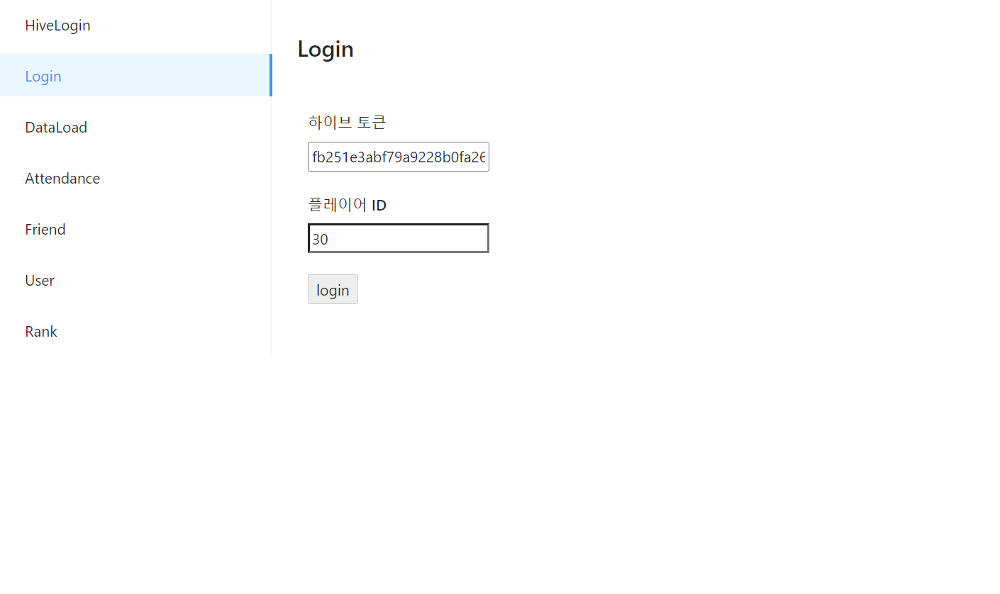
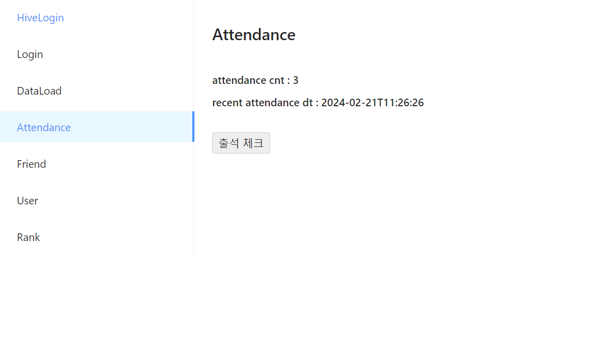
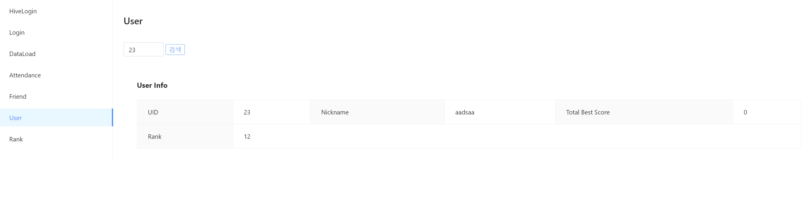
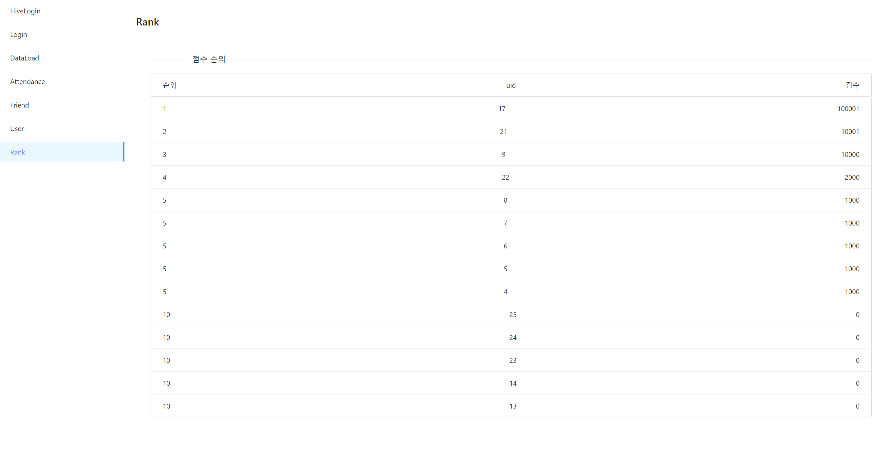

# Blazor

https://github.com/thatslifebro/MiniGameHeavenAPIServer

위 프로젝트를 위한 툴입니다.

### HiveLogin

이메일과 비밀번호를 받아 로컬 스토리지에 playerId와 하이브 토큰을 저장합니다.

### Login

로컬 스토리지에서 데이터가 있다면 가져와 자동 입력하고, 세션 스토리지에 uid와 토큰을 저장합니다.

### DataLoad

유저의 데이터를 불러옵니다.

### Attendance

유저의 이번달 출석 현황과 최근 출석일을 보여줍니다.

### Friend

친구 정보를 불러오고 추가, 삭제, 요청 수락 및 취소가 가능합니다.
![friend]/img/friend.PNG)

### User

다른 유저의 정보를 간략히 보여줍니다.

### Rank

상위 랭크를 보여줍니다.

